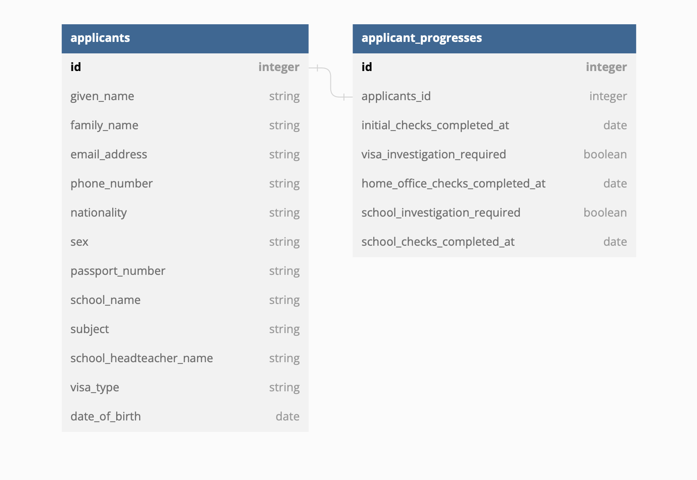

# 3. Initial data model

Date: 2023-06-01

## Status

Accepted

## Context

In the coming months we will be building this application. The first order of business is to come up with a sensible data model and application structure.

## Decision

We discussed a database model that is based around a small number of tables. In particular:

- `Applicants`, holds information about the applicant, including their personal details, and their contact details.
- `ApplicantProgresses`, which belongs to Applicants, and holds information about the applicant's progress through the application.

There might be some other models for auditing or master data that we have not identified yet. 

Although column names will change over time, the eventual table structure will look something like this:

## Consequences

This is a simple design that will allow us to get started quickly. It will be easy to change as we learn more about the domain.

