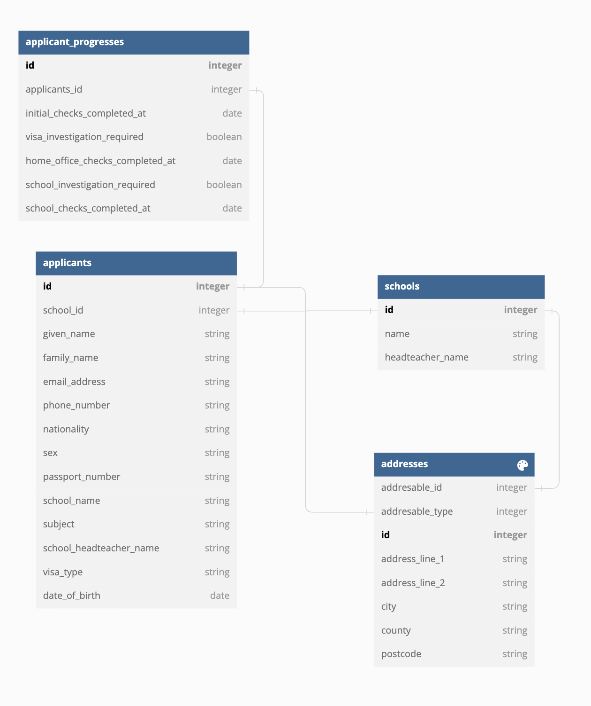

# 5. Update domain: extract `Address` domain class

Date: 2023-06-14

## Status

Accepted

## Context

We need to record the school address as per a new requirement. Our 
domain currently stores the applicant address, but we don't do the same for 
schools. 

To cover the new requirement we could add the new fields to the `School` 
domain model, but it presents a few drawbacks

1. Duplication of the following attributes in two models (`School` and 
   `Applicant`): `postcode`, `address_line_1`, `address_line_2`, `city` and 
   `postcode`. 
2. Validation or business logic related to addresses needs to be done twice, 
   making the code more difficult to maintain.
3. The `School` domain model will grow in complexity, making it more difficult 
   to read and reason about.

## Decision

Extract an `Address` domain class that stores:

- address_line_1
- address_line_2
- city
- county
- postcode

We will make this model polymorphic so it can be used by other models. As of 
now, it will store addresses for:

- Applicants
- Schools

## Consequences

This will make `School` and `Applicant` domain classes easier to read and 
maintain, although the domain will be a bit more elaborated.
