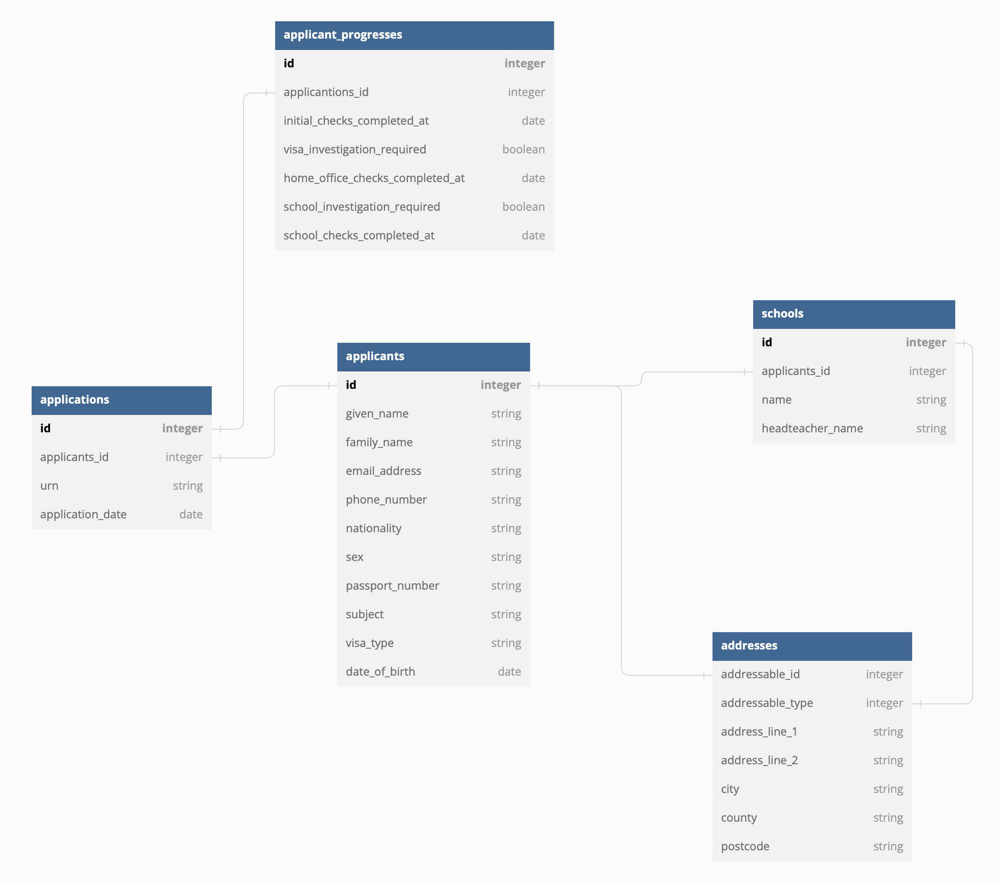

# 6. Update domain: extract Application model

Date: 2023-06-19

## Status

Accepted

## Context

On our domain the `Applicant` is the main entity. It' used for:

1. Store the personal details (name, email, passport...)
2. Store the application details (application date and URN)

This is good for the current use case, but it has the following implications:

1. In the real-world, the Applicant is the human being that is applying
   for the relocation package; the Applicant's identity is provided by the 
   passport. Other attributes, like the `URN` is not part of the Applicant 
   identity but of the Application identity. 
2. The Applicant entity is created at the end of the journey (when the
   user has entered his personal details and also the employment details). 
   Because we are linking the `URN` existence to the Applicant creation, we 
   need to track Applicant attributes throughout all the journey. 
3. If we decide to change the UI to allow the user to enter his personal
   details and employment details in many steps, we will need to change the
   persistence of the attributes through the journey.

## Decision

Introduce in the domain the `Application`.

An `Applicant` can have only one `Application`: `one-to-one`. The `FK` 
will be created the `Application` model in preparation for migrating to 
`one-to-many` 

The Application will store:

- `application_date` 
- `URN`

The applicant details will be persisted as the questions are being answered.

## Consequences

1. Some applicants will be incomplete, but if we have an application, it will 
be perfectly completed. Seems like a win-win.
2. We can persist any attributes on the applicant as the journey progresses
3. In the long run, the same applicant, can have more than one application 
   if needed
4. The codebase is more aligned with reality in terms of identity. Removing 
   the `urn` from the applicant seems aligned with the business domain.
